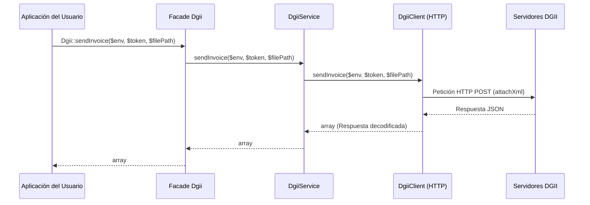
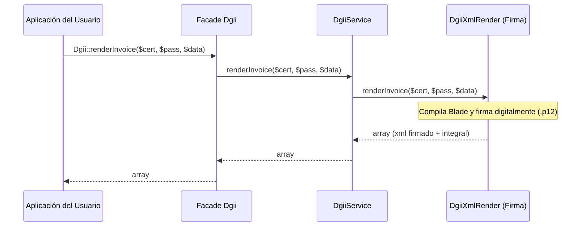

# Arquitectura del Proyecto (v1.3.8)

Este paquete sigue una arquitectura minimalista, de alto rendimiento y orientada a servicios. Está diseñado para ser un facilitador (enabler) del ecosistema de Laravel que simplifica los puntos complejos de la integración con la DGII (firma digital, autenticación por semillas, peticiones HTTP y consultas de estatus) sin ocultar o complicar el flujo nativo establecido por la DGII.

---

## 🏗️ Capas del Sistema

A partir de la versión **v1.3.8**, la arquitectura fragmentada de múltiples clases de acción individuales ha sido consolidada en dos subcapas de servicios especializados orquestados por un Gateway único. La interacción con el paquete fluye de manera directa y plana:

```
                    ┌──────────────────────────────────┐
                    │    Aplicación de Usuario (App)   │
                    └─────────────────┬────────────────┘
                                      │
                                      ▼
                    ┌──────────────────────────────────┐
                    │      Facade Estático Dgii        │
                    └─────────────────┬────────────────┘
                                      │ (Reenvía llamadas)
                                      ▼
                    ┌──────────────────────────────────┐
                    │      Gateway: DgiiService        │
                    └─────────┬────────────────┬───────┘
                              │                │
             (Firma y Render) │                │ (Peticiones HTTP)
                              ▼                ▼
                    ┌───────────┐            ┌───────────┐
                    │DgiiXml    │            │DgiiClient │
                    │Render     │            │           │
                    └───────────┘            └─────┬─────┘
                                                   │
                                                   ▼
                                             ┌───────────┐
                                             │ Servidores│
                                             │    DGII   │
                                             └───────────┘
```

1. **Facade (`Dgii`):** Interfaz pública principal del paquete. Simplifica el uso del servicio exponiendo métodos estáticos listos para consumir.
2. **Gateway Service (`DgiiService` en `src/Services/DgiiService.php`):** Es el único servicio del paquete, encargado de actuar como una puerta de enlace unificada. Inyecta directamente los servicios internos y los expone en firmas de métodos limpias que reciben y retornan datos primitivos (`array`, `string`).
3. **Internal Services (`src/Services/`):**
   * **`DgiiXmlRender` (`src/Services/DgiiXmlRender.php`):** Encargado de la compilación de plantillas Blade y la aplicación de la firma digital PKCS#12 (XMLDSig) utilizando la librería `php-dgii-xml-signer`.
   * **`DgiiClient` (`src/Services/DgiiClient.php`):** Centraliza la comunicación HTTP nativa optimizada mediante macros de Laravel, aislando el envío de semillas, facturas estándar, consumo, anulaciones y consultas de disponibilidad.
4. **Templates (`resources/views/`):** Plantillas Blade opcionales que proveen una base estándar para renderizar los XML solicitados por la DGII antes de ser firmados digitalmente.

---

## 🔄 Flujo de Trabajo (Workflow)

Cuando el usuario invoca un método desde el **Facade `Dgii`**, se ejecuta el siguiente flujo coordinado por `DgiiService`:



De igual forma, para el renderizado y firma de un e-CF:



---

## 💡 Ventajas del Diseño v1.3.8

Esta consolidación arquitectónica de múltiples acciones individuales a servicios dedicados aporta:
1. **Rendimiento e Integridad:** Reduce drásticamente el número de archivos cargados por el framework durante las peticiones, disminuyendo el "overhead" de inicialización.
2. **Autocompletado y Facilidad de Uso:** Al estar todos los métodos centralizados directamente en `DgiiService`, los IDEs pueden sugerir parámetros y tipos de retorno con total precisión, facilitando la experiencia del desarrollador.
3. **Mantenibilidad Extrema:** Si la DGII modifica endpoints o añade campos a sus respuestas, el mantenimiento se reduce a editar `DgiiClient` o `DgiiXmlRender` sin tener que alterar múltiples clases dispersas o jerarquías complejas de DTOs.
4. **Respeto al Principio Stateless:** El paquete se mantiene 100% libre de estado. No almacena de forma persistente tokens ni llaves, asegurando una compatibilidad nativa óptima con entornos multi-inquilino (multi-tenant).
