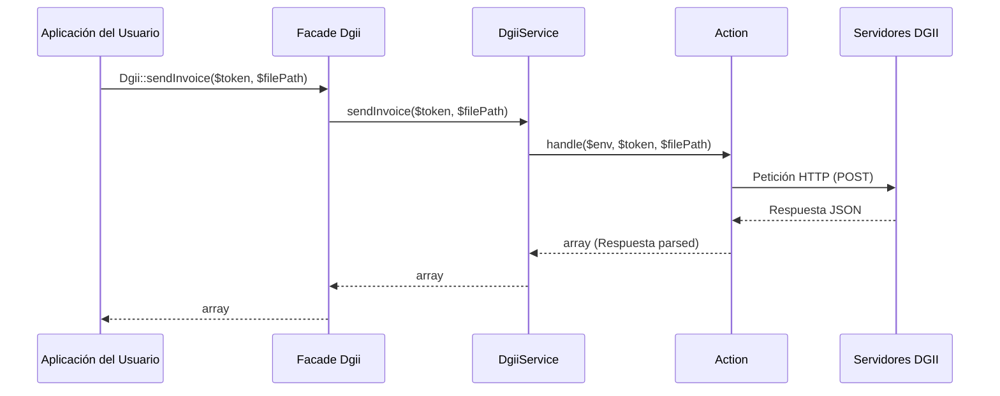

# Arquitectura del Proyecto (v1.3.4)

Este paquete sigue una arquitectura minimalista y orientada a acciones. Está diseñado para ser un facilitador (enabler) del ecosistema de Laravel que simplifica los puntos complejos de la integración con la DGII (firma digital, autenticación por semillas, peticiones HTTP y consultas de estatus) sin ocultar o complicar el flujo nativo establecido por la DGII.

## Capas del Sistema

La interacción con el paquete fluye de manera directa y plana:

1. **Facade (`Dgii`):** Interfaz pública principal del paquete. Simplifica el uso del servicio exponiendo métodos estáticos.
2. **Gateway Service (`DgiiService`):** Es el único servicio del paquete, encargado de actuar como una puerta de enlace unificada. Inyecta directamente las acciones y las expone en firmas de métodos limpias que reciben y retornan datos primitivos (`array`, `string`, `bool`).
3. **Actions (`src/Actions/`):** El corazón de la lógica de negocio reside en acciones atómicas. Cada acción (`Action`) tiene una única responsabilidad (`handle()`):
   * **Seeds:** Obtención y validación de semillas de autenticación de la DGII.
   * **Invoices:** Generación, firma digital, envío y consulta de facturas electrónicas (e-CF).
   * **ConsumerInvoices:** Lógica específica para facturas electrónicas de consumo.
   * **CancellationRanges:** Solicitud de anulación de rangos de e-CF (ANECF).
   * **CommercialApprovals:** Envío de aprobaciones comerciales de e-CF (ARECF/ACECF).
   * **Acknowledgments:** Generación de acuses de recibo.
   * **Dgii:** Monitoreo y consulta de disponibilidad de servidores de la DGII.
4. **Templates (`resources/views/`):** Plantillas Blade opcionales que proveen una base estándar para renderizar los XML solicitados por la DGII antes de ser firmados digitalmente.

---

## Flujo de Trabajo (Workflow)

Cuando el usuario invoca un método desde el **Facade `Dgii`**:

Esta separación atómica permite:
1. **Control Total:** El desarrollador puede elegir ignorar las plantillas del paquete, generar su propio XML y simplemente usar el paquete para firmar (`RenderInvoiceXmlAction`) y enviar (`SendInvoiceAction`).
2. **Facilidad de Testeo:** Cada acción es una clase simple e independiente, permitiendo probar flujos particulares mediante `Http::fake()` de forma ágil.
3. **Mantenimiento Cero:** Si la DGII agrega un nuevo campo a un servicio web, no es necesario actualizar una jerarquía de DTOs en el paquete; el desarrollador pasa los datos nativos correspondientes.
